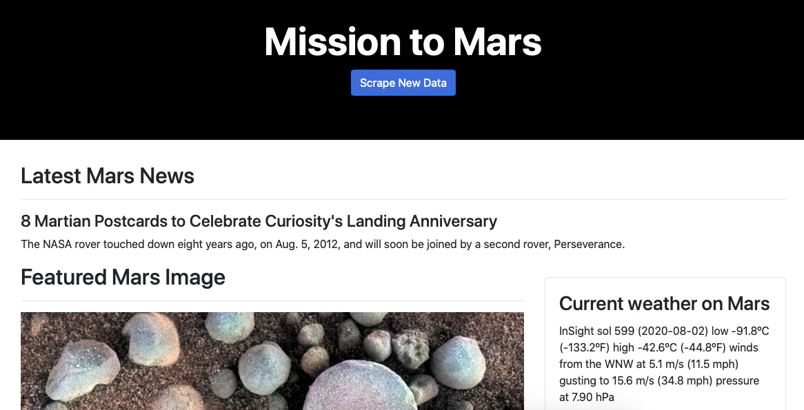
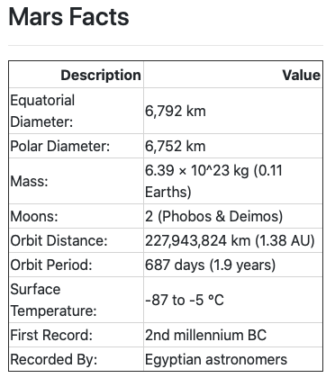

# Web Scrapping(Mars Proyect)

This activity was focused on building a web application that scrapes distinct sites for data and display this information in an HTML page. The sites that are scrapped are the following:

* [NASA Mars News Site](https://mars.nasa.gov/news/) and collect the latest News Title and Paragraph Text
* JPL Featured Space Image [here](https://www.jpl.nasa.gov/spaceimages/?search=&category=Mars).
* Mars Weather twitter account [here](https://twitter.com/marswxreport?lang=en) to scrape the latest Mars weather tweet from the page. 
* Mars Facts webpage [here](https://space-facts.com/mars/) to scrape the table containing facts about the planet including Diameter, Mass, etc.
* USGS Astrogeology site [here](https://astrogeology.usgs.gov/search/results?q=hemisphere+enhanced&k1=target&v1=Mars) to obtain high resolution images for each of Mar's hemispheres.

## Features

* Web scrapping from different sites(NASA, twitter) using BeautifulSoup and splinter 
* Use of MongoDB with Flask templating to create a HTML page

## Built with 

* Flask

## Outcomes

Main web application page. The button scrapes for new information and send it to a Mongo database. 

Example of some of the information scrapped with Python BeautifulSoup.

